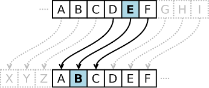

# Substitution Cipher



In a substitution cipher, we “encrypt” (i.e., conceal in a reversible way) a message by replacing every letter with another letter. To do so, we use a key: in this case, a mapping of each of the letters of the alphabet to the letter it should correspond to when we encrypt it. To “decrypt” the message, the receiver of the message would need to know the key, so that they can reverse the process: translating the encrypt text (generally called ciphertext) back into the original message (generally called plaintext).

A key, for example, might be the string NQXPOMAFTRHLZGECYJIUWSKDVB. This 26-character key means that A (the first letter of the alphabet) should be converted into N (the first character of the key), B (the second letter of the alphabet) should be converted into Q (the second character of the key), and so forth.

A message like HELLO, then, would be encrypted as FOLLE, replacing each of the letters according to the mapping determined by the key.

For example, if the user inputs a key of VCHPRZGJNTLSKFBDQWAXEUYMOI and a plaintext of HELLO:

```
$ ./substitution VCHPRZGJNTLSKFBDQWAXEUYMOI
plaintext:  hello, world
ciphertext: jrssb, ybwsp
```


# How to run the programs?

1. Compile by running make substitution or clang -o substitution substitution.c -lcs50 in terminal
2. Run the program by running ./substitution


# Word of caution when compiling

You must install CS50 library for C in order to compile. Installation guide is [here](https://cs50.readthedocs.io/library/c/). 